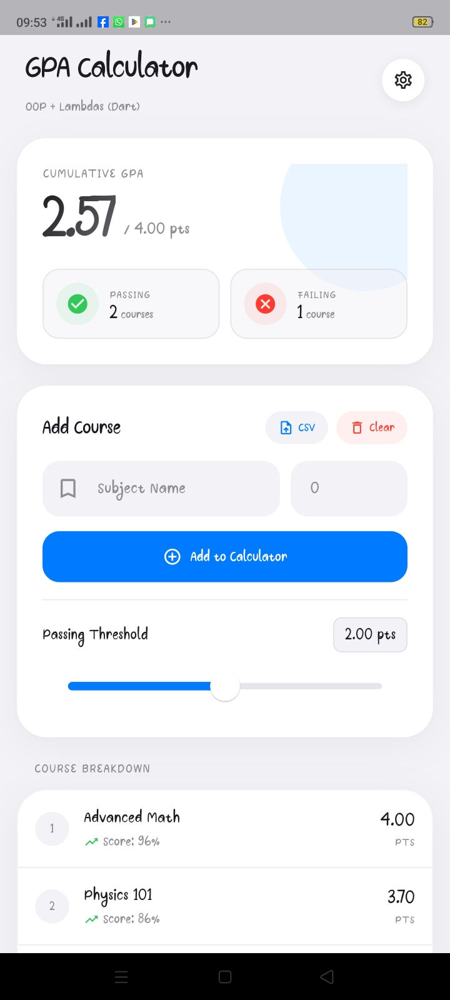
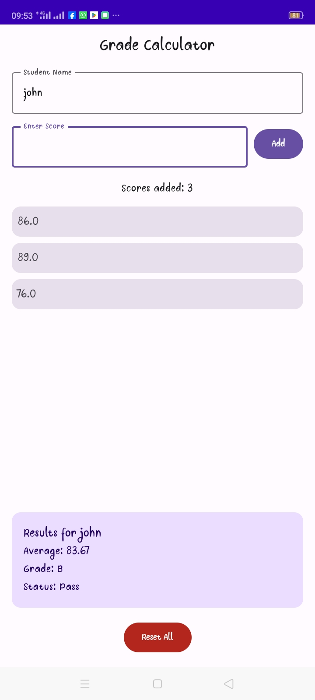

# GPA Calculator Monorepo

## UI Preview

Beautiful modern UI (Dart/Flutter):




Simpler UI (Kotlin):




This repository is organized into separate Kotlin and Dart projects.

## Repository Structure

- `kotlin/`
  - `grade_calculator_kotlin/`: Kotlin/Gradle grade calculator console project
- `dart/`
  - `flutter_gpa_calculator/`: Flutter app
  - `console_gpa_calculator/`: Dart console GPA calculator (manual + CSV import/export)

## Quick Start

### Dart console app

```powershell
cd "dart/console_gpa_calculator"
dart run
```

### Flutter app

```powershell
cd "dart/flutter_gpa_calculator"
flutter run
```

### Kotlin app (Gradle)

```powershell
cd "kotlin/grade_calculator_kotlin"
.\gradlew.bat :app:runKotlin --console=plain
```

## Notes

- Each section has its own README:
  - `dart/README.md`
  - `kotlin/README.md`
- Each project also contains its own project-level README.
